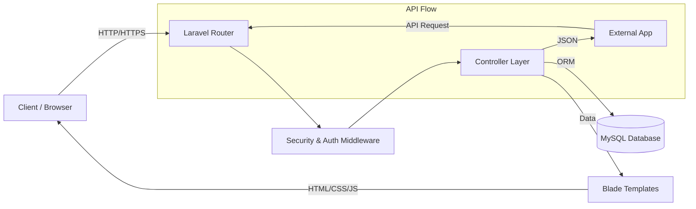

# VerdeLib - Project Documentation

## 1. Technology Choice
**Selected Framework**: Laravel 10.x (PHP)
**Rationale**: Laravel was chosen for its robust ecosystem, expressive syntax, and built-in features for authentication, database interaction (Eloquent ORM), and API development, which perfectly align with the project requirements.

---

## 2. Design Patterns Used

VerdeLib implements several key software design patterns to ensure modularity, scalability, and maintainability:

### **Model-View-Controller (MVC)**
*   **Description**: The core architectural pattern where the application is divided into three interconnected parts.
*   **Implementation**:
    *   **Models** (`App\Models\*`): Handle database interactions and business logic (e.g., `Book`, `User`, `Page`).
    *   **Views** (`resources\views\*`): Blade templates that render the user interface (e.g., `books.index`, `layouts.app`).
    *   **Controllers** (`App\Http\Controllers\*`): Handle user requests, process data using Models, and return Views or JSON responses.
*   **Benefit**: Separates concerns, making the code easier to debug and allowing frontend and backend work to proceed in parallel.

### **Repository / Resource Pattern (via Eloquent)**
*   **Description**: Abstracting data access logic.
*   **Implementation**: While not using strict separate Repository classes, the project leverages Laravel's **Resource Controllers** (`Route::resource`) and **Eloquent ORM** to standardize CRUD operations.
*   **Benefit**: Provides a consistent standard for naming routes and controller methods (`index`, `store`, `update`, `destroy`), making the API predictable.

### **Middleware Pattern**
*   **Description**: Filtering HTTP requests entering the application.
*   **Implementation**: Custom middleware (`role:staff,librarian`, `auth`) is used to intercept requests and enforce security policies before they reach the controller.
*   **Benefit**: Centralizes authentication and authorization logic, keeping controllers clean and secure.

### **Observer Pattern (Frontend)**
*   **Description**: Reacting to changes in state.
*   **Implementation**: Used via **Alpine.js** in the frontend for interactive elements like the "Edit Mode" toggle and dropdown menus (`x-data`, `x-show`).
*   **Benefit**: enhance user experience with reactive, instant UI updates without full page reloads.

---

## 3. Web Application Architecture

The system follows a monolithic architecture with a unified codebase for both the web interface and the API, serving distinct clients.

### **High-Level Diagram**

### **Core Components**
1.  **Client-Side (Frontend)**:
    *   **Technology**: HTML5, TailwindCSS, Alpine.js, Blade Templates.
    *   **Responsibility**: Renders the UI, handles user input, and communicates with the backend via AJAX (e.g., for inline page editing).
    *   **Responsive Design**: Mobile-first approach using Tailwind's utility classes.

2.  **Server-Side (Backend)**:
    *   **Technology**: PHP (Laravel).
    *   **Responsibility**:
        *   **Routing**: Directs traffic to appropriate controllers.
        *   **Authentication**: Manages sessions and strict role-based access control (Librarian vs. Staff vs. Member).
        *   **Business Logic**: Validates data and manages workflows (e.g., borrowing books).

3.  **Database**:
    *   **Technology**: MySQL.
    *   **Responsibility**: Persistent storage of relational data (Users, Books, Borrowings, CMS Pages).
    *   **Migrations**: Database schema is version-controlled using Laravel Migrations.

---

## 4. Web API Implementation

The project exposes a comprehensive RESTful API to support external integrations and core functionalities.

### **API Structure**
*   **Base URL**: `/api`
*   **Format**: JSON Request/Response
*   **Authentication**: Laravel Sanctum (Token-based authentication).

### **Key Endpoints**

| Method | Endpoint | Description | Access |
| :--- | :--- | :--- | :--- |
| **Auth** | | | |
| `POST` | `/api/login` | Authenticate user and issue token | Public |
| `POST` | `/api/logout` | Revoke current token | Auth |
| **Books** | | | |
| `GET` | `/api/books` | List books (supports search/filter) | Public |
| `GET` | `/api/books/{id}` | Get specific book details | Public |
| `POST` | `/api/books` | Create a new book | Staff/Lib |
| `PUT` | `/api/books/{id}` | Update book details | Staff/Lib |
| `DELETE` | `/api/books/{id}` | Remove a book | Staff/Lib |
| **CMS** | | | |
| `GET` | `/api/pages` | List content pages | Public |
| `PUT` | `/api/pages/{id}` | Update page content | Staff/Lib |

### **Interaction Flow**
1.  **Request**: Client sends a JSON request (e.g., `{ "title": "New Book" }`) to an endpoint.
2.  **Validation**: Backend validates the input using FormRequests.
3.  **Processing**: Controller delegates the action to a Model.
4.  **Response**: Server returns a JSON object with a status code (e.g., `200 OK`, `201 Created`, `422 Unprocessable Entity`).

### **Security**
*   **Rate Limiting**: Prevent abuse by limiting requests per minute.
*   **Token Verification**: Protected routes require a valid Bearer Token in the `Authorization` header.
*   **Sanitization**: All inputs are sanitized to prevent SQL injection and XSS attacks.

---

## 5. Security Measures Implemented

The application integrates rigorous security protocols to protect user data and system integrity:

### **Authentication & Authorization**
*   **Laravel Breeze (Web)**: Handles session-based authentication for the frontend, including Login, Logout, and Registration.
*   **Laravel Sanctum (API)**: Manages token-based API authentication, issuing revocable API tokens for external consumers.
*   **Role-Based Access Control (RBAC)**:
    *   **Middleware**: Custom `CheckRole` middleware enforces permissions at the route level.
    *   **Roles**: Strict segregation between `Librarian` (CMS Admin), `Staff` (Content Manager), and `Member` (User). access.

### **Data Protection**
*   **Input Validation**: All incoming HTTP requests are validated using Laravel's strict `FormRequest` classes (e.g., `store(Request $request)`), rejecting malformed data before processing.
*   **SQL Injection Prevention**: Usage of Eloquent ORM ensures all database queries are essentially prepared statements, automatically escaping user input.
*   **XSS Protection**: Blade templating engine automatically escapes output (`{{ $variable }}`) to prevent Cross-Site Scripting. We use `{!! !!}` only for sanitized HTML content (Quill Editor) where necessary.

### **Session & Transport**
*   **CSRF Protection**: All `POST`, `PUT`, and `DELETE` requests in the web application are protected by CSRF tokens to prevent Cross-Site Request Forgery.
*   **Session Management**: Secure, server-side session storage with configurable lifetime and "HttpOnly" cookies to prevent client-side script access.
*   **Encryption**: All sensitive data (passwords) is hashed using **Bcrypt** before storage.

