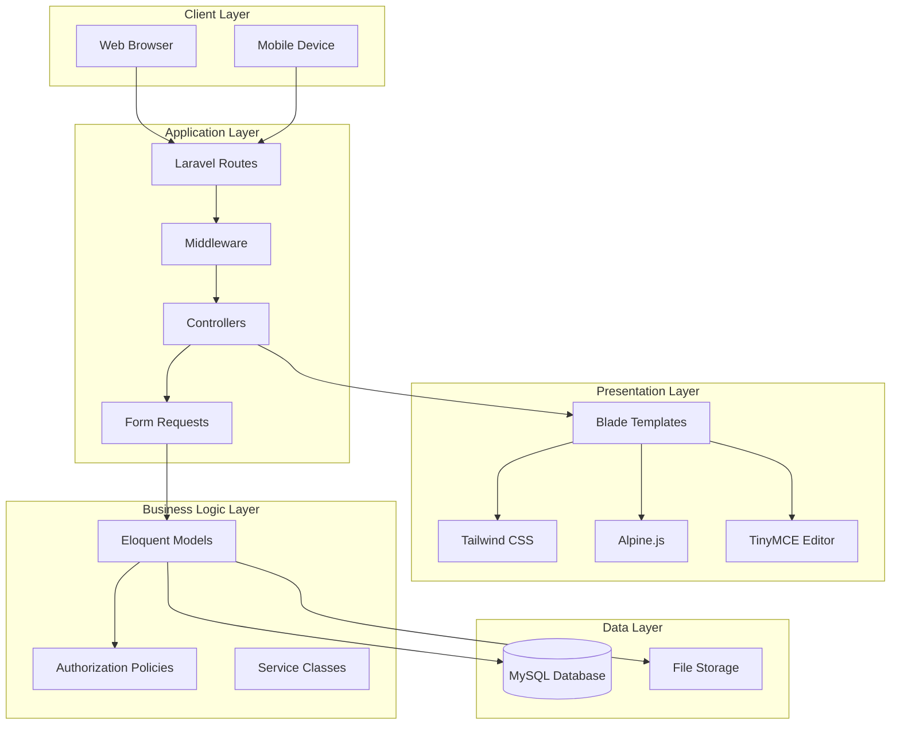

# Library CMS

A modern, feature-rich Content Management System built with Laravel 12 for managing library resources, books, news, pages, and staff information.

## Table of Contents
- [Features](#features)
- [System Requirements](#system-requirements)
- [Installation](#installation)
- [Design Patterns](#design-patterns)
- [Web Application Architecture](#web-application-architecture)
- [Web API Implementation](#web-api-implementation)
- [User Guide](#user-guide)
- [Troubleshooting](#troubleshooting)

---

## Features

### Content Management
- **Dynamic Pages**: Create and manage custom pages with WYSIWYG editor (TinyMCE)
- **News System**: Publish announcements and news articles with featured images
- **Resource Management**: Organize and share library resources and external links
- **Staff Directory**: Showcase library team members with profiles and contact information

### User Management
- **Role-Based Access Control**: Admin, Librarian, and Member roles
- **Authentication**: Secure login/register with input validation and sanitation
- **User Profiles**: Customizable user information and preferences

### Navigation
- **Dynamic Menus**: Drag-and-drop menu builder for custom navigation
- **SEO-Friendly URLs**: Clean, readable URLs for all public pages
- **Responsive Design**: Mobile-first design with Tailwind CSS v4

### Additional Features
- **Public Book Catalog**: Browse and search the library's collection publicly
- **Book Management**: Detailed book inventory with categories, authors, and chapter contents
- **Borrowing System**: Track borrowed books and view details in member dashboard
- **Audit Logging**: Track changes and user activities
- **Security Headers**: CSP and other security headers implemented
- **Modern UI**: Clean, professional interface with smooth animations

---

## System Requirements

- **PHP**: >= 8.2
- **Composer**: Latest version
- **Node.js**: >= 18.x
- **NPM**: Latest version
- **Database**: MySQL 8.0+ or MariaDB 10.4+
- **Web Server**: Apache/Nginx with mod_rewrite enabled

---

## Installation

### Quick Start (Recommended)
You can set up the entire project with a single command which handles dependencies, environment, keys, migrations, and assets:
```bash
composer run setup
php artisan storage:link
```

### Manual Installation

### 1. Clone the Repository
```bash
git clone <repository-url>
cd library-cms
```

### 2. Install Dependencies
```bash
# Install PHP dependencies
composer install

# Install JavaScript dependencies
npm install
```

### 3. Environment Configuration
```bash
# Copy environment file
cp .env.example .env

# Generate application key
php artisan key:generate
```

### 4. Configure Database
Edit `.env` file:
```env
DB_CONNECTION=mysql
DB_HOST=127.0.0.1
DB_PORT=3306
DB_DATABASE=library_cms
DB_USERNAME=root
DB_PASSWORD=your_password
```

Create the database:
```sql
CREATE DATABASE library_cms CHARACTER SET utf8mb4 COLLATE utf8mb4_unicode_ci;
```

### 5. Run Migrations and Seeders
```bash
# Run migrations
php artisan migrate

# Seed initial data (admin user, sample data)
php artisan db:seed

# IMPORTANT: Create storage symlink for file uploads
php artisan storage:link

# (Optional) Seed default navigation menus
php artisan db:seed --class=DefaultMenuSeeder
```

### 6. Build Assets
```bash
# Development
npm run dev

# Production
npm run build
```

### 7. Start Development Server
```bash
php artisan serve
```

Visit `http://127.0.0.1:8000`

### Default Admin Credentials
- **Email**: admin@library.com
- **Password**: admin123

**⚠️ IMPORTANT**: Change the default password immediately after first login!

---

## Design Patterns

### 1. Model-View-Controller (MVC)
The application strictly follows Laravel's MVC architecture:
- **Models**: Eloquent ORM models in `app/Models/` represent database entities
- **Views**: Blade templates in `resources/views/` handle presentation
- **Controllers**: Business logic in `app/Http/Controllers/` organized by domain

**Example**:
```
Page (Model) ← PageController (Controller) → pages/edit.blade.php (View)
```

### 2. Repository Pattern
While not fully implemented, the codebase uses Eloquent models as data repositories, abstracting database operations.

**Benefits**:
- Separation of concerns
- Easier testing and maintenance
- Database-agnostic queries

### 3. Policy Pattern (Authorization)
Laravel Policies control access to resources:
- `app/Policies/PagePolicy.php` - Controls page access
- `app/Policies/NewsPolicy.php` - Controls news access

**Example**:
```php
// Only admins can delete pages
public function delete(User $user, Page $page): bool
{
    return $user->isAdmin();
}
```

### 4. Request Validation Pattern
Form Request classes validate and authorize incoming data:
- `app/Http/Requests/StorePageRequest.php`
- `app/Http/Requests/UpdatePageRequest.php`

**Benefits**:
- Centralized validation logic
- Reusable across controllers
- Clean controller code

### 5. Service Provider Pattern
Laravel's service providers bootstrap application services:
- `AppServiceProvider` - Application-level bindings
- `RouteServiceProvider` - Route configuration
- `AuthServiceProvider` - Policy registration

### 6. Observer Pattern
Model events and observers (can be implemented):
```php
// Example: audit logging on model changes
Page::updated(function ($page) {
    AuditLog::create([...]);
});
```

### 7. Middleware Pattern
HTTP middleware filters requests:
- Authentication middleware
- Role-based access middleware
- Security headers middleware (`SetSecurityHeaders.php`)

### 8. Factory Pattern
Database factories for testing and seeding:
```php
User::factory()->count(10)->create();
```

---

## Web Application Architecture

### System Overview



### Component Architecture

#### 1. Client-Side Components

**Technologies**:
- **Tailwind CSS**: Utility-first CSS framework for responsive design
- **Alpine.js**: Lightweight JavaScript framework for interactivity
- **TinyMCE**: Rich text WYSIWYG editor for content creation
- **Vite**: Modern build tool for asset compilation

**Key Files**:
- `resources/css/app.css` - Main stylesheet
- `resources/js/app.js` - Main JavaScript entry
- `vite.config.js` - Build configuration

#### 2. Server-Side Components

**Laravel Framework Components**:

**Routing** (`routes/`):
- `web.php` - Web application routes
- `api.php` - RESTful API endpoints

**Controllers** (`app/Http/Controllers/`):
```
Controllers/
├── Web/           # Web UI controllers
│   ├── PageController.php
│   ├── NewsController.php
│   ├── MenuController.php
│   └── ...
├── Api/           # API controllers
│   ├── PageController.php
│   ├── NewsController.php
│   └── ...
└── Public/        # Public-facing controllers
    └── PageController.php
```

**Models** (`app/Models/`):
- `User.php` - User authentication and roles
- `Page.php` - Dynamic pages
- `News.php` - News/announcements
- `Book.php` - Library books
- `Staff.php` - Staff members
- `Menu.php` - Navigation menus
- `Resource.php` - Library resources

**Middleware** (`app/Http/Middleware/`):
- `Authenticate.php` - Ensure user is logged in
- `SetSecurityHeaders.php` - Add security headers
- `role` - Role-based access control

#### 3. Database Architecture

**Schema Overview**:

```sql
-- Core Tables
users (id, name, email, role, ...)
pages (id, title, slug, content, is_published, ...)
news (id, title, content, image_path, ...)
books (id, title, author, isbn, ...)
staff (id, name, position, profile_image, ...)
menus (id, name, label, url, parent_id, display_order, ...)
resources (id, title, type, url, ...)
audit_logs (id, user_id, action, model_type, ...)

-- Relationships
books → categories (many-to-many)
books → authors (many-to-many)
menus → menus (parent-child hierarchy)
pages → users (creator relationship)
```

**Key Relationships**:
- Users have roles (admin, librarian, member)
- Pages belong to creators (users)
- Menus support hierarchical structure
- Books have many-to-many with categories and authors

#### 4. File Storage

**Storage Structure**:
```
storage/app/public/
├── news/           # News article images
├── staff/          # Staff profile images
├── books/          # Book cover images
└── resources/      # Resource files
```

**Symlink**: `public/storage` → `storage/app/public`

---

## Web API Implementation

### RESTful API Endpoints

The application provides a comprehensive RESTful API for programmatic access.

#### Base URL
```
http://localhost:8000/api
```

#### Authentication
All API requests require Bearer token authentication:
```
Authorization: Bearer {token}
```

**Obtaining a Token**:
```bash
POST /api/auth/login
Content-Type: application/json

{
  "email": "user@example.com",
  "password": "password"
}

Response:
{
  "token": "1|laravel_sanctum_token...",
  "user": { ... }
}
```

### API Endpoints

#### Pages API

**List Published Pages**
```http
GET /api/pages/published
Accept: application/json

Response 200:
{
  "data": [
    {
      "id": 1,
      "title": "About Us",
      "slug": "about-us",
      "content": "<p>Page content...</p>",
      "meta_description": "About our library",
      "is_published": true,
      "published_at": "2025-01-15T10:00:00.000000Z"
    }
  ]
}
```

**Get Single Page**
```http
GET /api/pages/{id}
Accept: application/json

Response 200:
{
  "data": {
    "id": 1,
    "title": "About Us",
    "slug": "about-us",
    "content": "<p>...</p>",
    "meta_description": "...",
    "is_published": true,
    "creator": {
      "id": 1,
      "name": "Admin User"
    }
  }
}
```

**Create Page** (Admin/Librarian)
```http
POST /api/pages
Authorization: Bearer {token}
Content-Type: application/json

{
  "title": "New Page",
  "slug": "new-page",
  "content": "<p>Page content</p>",
  "meta_description": "Description",
  "is_published": true
}

Response 201:
{
  "data": { ... },
  "message": "Page created successfully"
}
```

**Update Page** (Admin/Librarian)
```http
PUT /api/pages/{id}
Authorization: Bearer {token}
Content-Type: application/json

{
  "title": "Updated Title",
  "content": "<p>Updated content</p>"
}

Response 200:
{
  "data": { ... },
  "message": "Page updated successfully"
}
```

**Delete Page** (Admin only)
```http
DELETE /api/pages/{id}
Authorization: Bearer {token}

Response 200:
{
  "message": "Page deleted successfully"
}
```

#### News API

**List News Articles**
```http
GET /api/news
Accept: application/json

Query Parameters:
- page: int (pagination)
- per_page: int (default: 15)
- published: boolean

Response 200:
{
  "data": [ ... ],
  "links": { ... },
  "meta": { ... }
}
```

**Get News Article**
```http
GET /api/news/{id}

Response 200:
{
  "data": {
    "id": 1,
    "title": "Library Reopening",
    "excerpt": "Brief summary...",
    "content": "<p>Full content...</p>",
    "image_path": "news/image.jpg",
    "is_published": true,
    "published_at": "2025-01-15T10:00:00Z"
  }
}
```

#### Books API

**Search Books**
```http
GET /api/books
Accept: application/json

Query Parameters:
- search: string
- category: int
- author: int
- available: boolean

Response 200:
{
  "data": [
    {
      "id": 1,
      "title": "Book Title",
      "isbn": "978-...",
      "author": "Author Name",
      "category": "Fiction",
      "quantity": 5,
      "available_quantity": 3
    }
  ]
}
```

### API Response Format

**Success Response**:
```json
{
  "data": { ... },
  "message": "Operation successful",
  "status": 200
}
```

**Error Response**:
```json
{
  "message": "Error description",
  "errors": {
    "field": ["Validation error message"]
  },
  "status": 422
}
```

### API Rate Limiting
- **Authenticated**: 60 requests per minute
- **Guest**: 30 requests per minute

### CORS Configuration
Configured in `config/cors.php`:
- Allowed Origins: Configurable
- Allowed Methods: GET, POST, PUT, DELETE, PATCH
- Allowed Headers: Content-Type, Authorization

---

## User Guide

### Admin Panel Access
Navigate to `/login` and use admin credentials.

### Creating a Page
1. Go to **Pages** → **New Page**
2. Fill in title, slug, and meta description
3. Add content using the WYSIWYG editor
4. Check "Publish immediately" or schedule
5. Click **Create Page**

### Managing Menus
1. Go to **Menus**
2. Drag and drop items to reorder
3. Click **Save Menu Order**
4. Use **New Menu Item** to add links

### Publishing News
1. Go to **News** → **Create News**
2. Add title, excerpt, and content
3. Upload a featured image (optional)
4. Set publish date
5. Click **Publish**

---

## Troubleshooting

### Issue: "Storage symlink not found"
**Solution**:
```bash
php artisan storage:link
```

### Issue: "Page content not saving"
**Solution**: Ensure `content` column exists in pages table:
```bash
php artisan migrate
```

### Issue: "Permission denied" on storage
**Solution** (Linux/Mac):
```bash
chmod -R 775 storage bootstrap/cache
chown -R www-data:www-data storage bootstrap/cache
```

### Issue: "TinyMCE not loading"
**Solution**: Check CSP headers in `app/Http/Middleware/SetSecurityHeaders.php`

### Issue: "Menu order not saving"
**Solution**: Clear cache and ensure route exists:
```bash
php artisan route:clear
php artisan cache:clear
```

---

## Development

### Running Tests
```bash
php artisan test
```

### Code Style
```bash
./vendor/bin/pint
```

### Clear Caches
```bash
php artisan optimize:clear
```

---

## Production Deployment

### 1. Environment Setup
```bash
APP_ENV=production
APP_DEBUG=false
APP_URL=https://yourdomain.com
```

### 2. Optimize Application
```bash
composer install --optimize-autoloader --no-dev
php artisan config:cache
php artisan route:cache
php artisan view:cache
npm run build
```

### 3. Set Permissions
```bash
chmod -R 755 storage bootstrap/cache
```

### 4. Configure Web Server
Point document root to `/public` directory.

---

## License
This project is licensed under the MIT License.

## Support
For issues and feature requests, please contact the development team.
